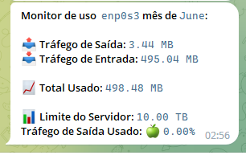

# tg-vnstat-monitor-bot
O script relata o uso do tráfego no mês atual (da ferramenta vnstat)

# Requisitos
* python3
* vnstat 

#Como parece?



# Instalação

# vnstat

```sh
# instalar vnstat
sudo apt-get install vnstat

# modifique a configuração ao seu gosto (a configuração padrão está ok)
sudo nano /etc/vnstat.conf 

# Começar serviço
sudo systemctl enable vnstat.service
sudo systemctl start vnstat.service

# verifique o status do serviço
sudo systemctl status vnstat.service
systemctl status vnstat

# verifique se o vnstat está funcionando
vnstat
```

# o script

1) Clonar repositório
```sh
cd ~
mkdir tgvnstat # change it if you want
cd tgvnstat

git clone https://github.com/WdsUtilidades/tgvnstatmonitor
cd tgvnstatmonitor

#cria o ambiente virtual

python3 -m venv APP_VENV
source APP_VENV/bin/activate

pip3 install -r requirements.txt
```

2) Faça um script de execução como este em `~/tgvnstat/report.sh` com o `nano report.sh`

```sh
#!/bin/bash

set -euo pipefail

export LIMIT_GIB=10240 # 10 TB é o limite não faturado padrão na Oracle
export INTERFACE=ens3
export TOKEN="your telegram bot token"
export TG_CHAT_ID="your telegram chat id"

set -x

cd tgvnstatmonitor
# git pull # auto-update repo

# ativar ambiente virtual
source APP_VENV/bin/activate

## inicia o bot
python3 main.py

# desativar ambiente virtual
deactivate
```

3) Adicionar ao cron

```sh
# todos os dias às 13:00. ver: https://crontab.guru/#0_13_*_*_*
# assumindo que /home/user/ é seu $HOME.
*/0 13 * * * cd /root/tgvnstat && ./report.sh > /dev/null
```
